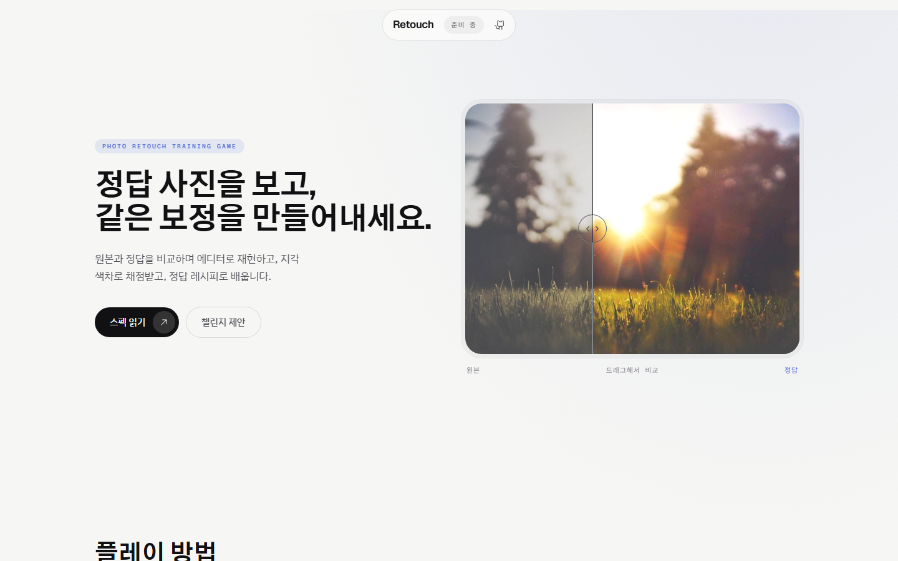

<p align="center">
  
</p>

<h1 align="center">Retouch</h1>

<p align="center">
  정답 사진을 보고, 같은 보정을 만들어내세요.<br />
  <sub>A photo-retouch training game. Compare, reproduce, get scored by perceptual color difference, learn from the recipe.</sub>
</p>

<p align="center">
  <a href="https://rwe.kr/retouch/"></a>
  <a href="https://github.com/gwanryo/retouch/actions/workflows/ci.yml"></a>
  <a href="https://github.com/gwanryo/retouch/actions/workflows/deploy.yml"></a>
  <a href="LICENSE"></a>
  
</p>

<p align="center">
  
</p>

<br />

## 무엇인가요

Retouch는 **사진 보정을 게임처럼 연습하는 학습 도구**입니다.

1. 원본 사진과 정답(보정된) 사진을 나란히 봅니다.
2. Lightroom 호환 슬라이더, HSL, 톤커브, 컬러 그레이딩, 선형·방사형·범위 마스크로 원본을 정답처럼 보정합니다.
3. 제출하면 지각 색차(CIEDE2000)로 **0~100점**을 받고, 톤·색·디테일·로컬·구도 다섯 진단 지표와 정답 레시피 해설로 무엇이 달랐는지 배웁니다.
4. 점수는 **내 결과만** 담긴 카드로 공유합니다. 정답도 원본도 노출되지 않아, 받은 친구는 힌트 없이 같은 챌린지에 도전할 수 있습니다.

> 현재 상태: 스펙과 구현 계획이 확정되었고 엔진(Rust → WASM) 구현을 시작하는 단계입니다. 라이브 페이지는 소개 랜딩입니다.

<br />

## 왜 이렇게 만들었나요

| 원칙 | 의미 |
|------|------|
| **정답은 항상 도달 가능** | 정답은 외부 작가의 보정물이 아니라 우리 엔진으로 렌더한 이미지입니다. 정답 레시피를 그대로 넣으면 어느 기기에서나 정확히 100점이 나옵니다. |
| **값이 아니라 결과를 채점** | 슬라이더 값을 비교하지 않습니다. 결과 이미지와 정답 이미지의 픽셀을 비교하므로, 다른 조합으로 같은 결과를 내도 만점입니다. |
| **상대 척도** | 원본 그대로 제출하면 0점, 지각적으로 동일하면 100점. 보정 폭이 큰 챌린지와 작은 챌린지가 같은 척도로 공정하게 채점됩니다. |
| **평가 영역** | 로컬 보정 챌린지는 정답 마스크 영역 안에서 채점하고, 영역 밖을 건드리면 누출 페널티를 받습니다. 작은 영역의 섬세한 보정도 챌린지가 될 수 있습니다. |
| **채점은 심판이 아니라 선생** | 제출 후 정답 레시피와 영역별 관측 문장이 공개됩니다. 부정 방지 대신 배움에 최적화했습니다. |
| **서버도 계정도 없음** | 정적 사이트 하나. 디코드, 렌더, 채점, 카드 생성이 전부 브라우저 안에서 끝납니다. 베스트 점수는 localStorage에 남습니다. |

전체 결정과 인수 기준은 [스펙 v2](.omc/specs/deep-interview-photo-edit-match-game.md)에, 아키텍처와 인터페이스는 [마스터 플랜](.omc/plans/00-master-plan.md)에 있습니다.

<br />

## 어떻게 동작하나요

```
                 ┌──────────────────────────────────────────┐
  content/       │  engine (Rust)                            │
  originals ──►  │  decode ► render ► Lanczos3 ► Lab ► ΔE00  │ ──► answers/ + golden hashes  (build time, native CLI)
  recipes   ──►  │  same source, two builds                   │
                 └───────────────┬──────────────────────────┘
                                 │ wasm32 (Web Worker)
                                 ▼
  web (React + WebGL2)   슬라이더 조작 중: GPU 프리뷰 (근사, 점수 계약 밖)
                         제출 시: WASM 참조 렌더 ► 채점 ► 결과/해설 ► 카드 PNG ► 공유
```

- **결정성이 전부입니다.** 참조 엔진은 초월함수를 순수 Rust `libm`으로만 계산하고, JPEG 디코드까지 엔진 안에서 수행합니다. 브라우저·OS가 달라도 1024px 채점 이미지의 SHA-256이 같아야 하며 CI가 ubuntu·windows·macos 네이티브와 wasm에서 이를 검증합니다.
- **GPU는 프리뷰 전용입니다.** WebGL2 셰이더는 참조 엔진과 같은 순서·수식을 따르되, 입력이 멈추면 500ms 안에 참조 렌더로 교체됩니다.
- **레시피는 Lightroom `crs` 스키마와 호환됩니다.** XMP 프리셋을 챌린지로 임포트하고, 정답 레시피를 XMP로 내보내 Lightroom에서 열 수 있습니다(글로벌 파라미터 한정).

```
retouch/
├─ engine/     Rust 워크스페이스: core(색 과학·렌더·채점) · cli · wasm
├─ web/        Vite + React + TypeScript + Tailwind v4 + WebGL2
├─ content/    원본(CC0) · 레시피 · 생성된 정답 · manifest.json
├─ .omc/       스펙 · 계획 (이 프로젝트의 진실의 원천)
└─ .github/    CI(3 OS) · Pages 배포 · 이슈/PR 템플릿
```

<br />

## 시작하기

### 요구 사항

- Node 24+
- Rust stable (1.80+) with `wasm32-unknown-unknown`, `wasm-pack` (엔진 작업 시)

### 웹

```bash
cd web
npm ci
npm run dev        # http://localhost:5173/retouch/
npm run check      # lint + typecheck + test
npm run build      # dist/ (+ 404.html SPA fallback)
```

### 엔진 (Plan 1a 진행 중)

```bash
cargo test --manifest-path engine/Cargo.toml --workspace
bash scripts/lint-determinism.sh                       # std 수학 함수 사용 차단
wasm-pack build engine/wasm --target nodejs
node --test engine/wasm/test                           # wasm 출력 == 네이티브 골든
```

### 배포

`main`에 푸시하면 GitHub Actions가 빌드해 GitHub Pages로 배포합니다. 도메인 `rwe.kr`은 [`gwanryo.github.io`](https://github.com/gwanryo/gwanryo.github.io)에 걸려 있어 이 저장소는 자동으로 `https://rwe.kr/retouch/`에 뜹니다.

<br />

## 로드맵

| 단계 | 내용 | 상태 |
|------|------|------|
| 스펙 | 20라운드 deep-interview + Codex 토론 반영, 결정 D1~D14, 인수 기준 약 70개 | ✅ v2 |
| 마스터 플랜 | 아키텍처 A1~A9, 레시피·매니페스트·Score·WASM 인터페이스 | ✅ |
| Plan 1a 엔진 기반 | 색 과학(ΔE00), Lanczos3, 레시피 스키마, 기본 패널 렌더, 채점 핵심, CLI, WASM, 3-OS 골든 CI | 🔜 승인 대기 |
| Plan 1b 엔진 완성 | HSL·커브·그레이딩·디테일, 마스크 3종, 크롭·구도 점수, 평가 영역, 진단 5종, XMP | ⏳ |
| Plan 2 에디터 | WebGL2 프리뷰, 패널·커브·마스크·크롭 UI(터치), 실행취소, 작성 모드 | ⏳ |
| Plan 3 콘텐츠·게임·공유 | 챌린지 15~20개(3단계), 결과 화면·해설, 카드 공유, 벤치, 출시 | ⏳ |

<br />

## 기여하기

- 버그, 기능, **챌린지 제안**은 [이슈 템플릿](https://github.com/gwanryo/retouch/issues/new/choose)으로.
- PR 전에 `web`은 `npm run check`, `engine`은 `cargo test` + 결정성 린트를 통과해야 합니다. 렌더·채점 수식을 바꿨다면 엔진/채점 버전을 올리고 골든을 다시 생성하세요.
- 스펙의 Non-Goals(서버, 계정, 브러시 마스크, 회전 크롭, 부정 방지 등)에 해당하는 제안은 v2 후보로 분류됩니다.
- Claude Code로 작업한다면 [`CLAUDE.md`](CLAUDE.md)의 스킬 사용 규칙(프론트 디자인·Rust)을 따릅니다.

<br />

## 라이선스와 크레딧

- 코드: [MIT](LICENSE)
- 챌린지 사진: CC0 / Unsplash / Pexels. 각 사진의 출처와 작가는 `content/manifest.json`에 기록됩니다.
- 랜딩 데모 사진: Jake Givens (Unsplash), [`web/public/demo/CREDITS.md`](web/public/demo/CREDITS.md)
- 레시피 제작 참고: Lightroom, Capture One, DaVinci Resolve, Snapseed, Photoshop, Evoto, Clip Studio의 공개 튜토리얼(기법만 참고, 자산 미사용)
